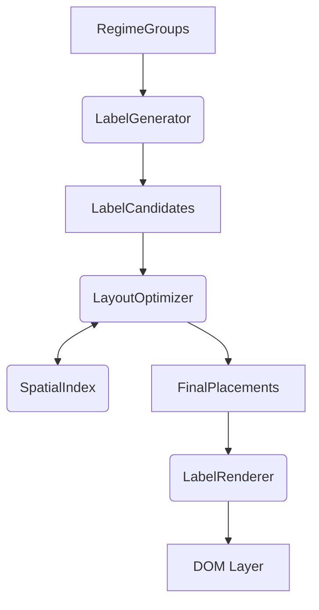

# 全景页标签系统重构计划 (Label System Refactoring)

## 📌 项目目标
彻底重构 `panorama.html` 中的标签渲染系统，解决视觉冲突、重叠和遮挡问题。采用 **DOM 渲染 + 空间索引 (Spatial Index) + 多候选位置评分** 的方案，在保持现有字效的前提下实现最佳布局。

## 🏗 架构设计

### 1. 模块化结构
将原有的 `Core.logic.calculateLabelPositions` 和 `Core.render.drawLabels` 拆解为独立的类/模块：

- **SpatialIndex (空间索引)**
  - 负责高效的碰撞检测查询。
  - 实现一个轻量级的 R-Tree 或优化的动态四叉树，将碰撞检测复杂度从 O(n²) 降至 O(log n)。
  - 支持查询区域内的所有矩形。

- **LabelGenerator (标签生成器)**
  - 负责为每个政权生成"逻辑标签"对象。
  - 计算标签的多种布局变体（Horizontal, Vertical, Wrap）和尺寸。
  - **输入**: `RegimeGroup`
  - **输出**: `LabelCandidate` 列表 (包含不同字号、换行方式的变体)

- **LayoutOptimizer (布局优化器)**
  - 核心调度器。
  - 负责候选位置的生成与评分。
  - **策略**:
    1. **多位置尝试**: 中心、顶部居中、底部居中、左上、右下等。
    2. **评分系统**: 
       - `Score = (Tier权重) * (可见性) - (重叠惩罚) - (越界惩罚)`
    3. **贪心 + 迭代**: 优先放置高 Tier 标签；若无解则尝试"挤压"低 Tier 标签（可选，第一阶段暂不实现挤压，只做避让）。

- **LabelRenderer (渲染器)**
  - 负责将确定好的 Label 数据转换为 DOM 元素。
  - 封装 CSS 类名和样式逻辑，保持与现有视觉风格一致。

### 2. 数据流程

## 📅 实施步骤

### Phase 1: 基础设施搭建
- [ ] 在 `panorama.html` 中建立 `Core.labelSystem` 命名空间。
- [ ] 实现 `SpatialIndex` 类 (基于 R-Tree 变体)。
- [ ] 实现 `LabelGenerator`，移植并优化现有的 H/V/Wrap 尺寸计算逻辑。

### Phase 2: 核心算法实现
- [ ] 实现 `PositionScorer` (评分逻辑)。
- [ ] 实现 `LayoutOptimizer` 主循环：
  - Sort by Tier & Area
  - Generate Candidates
  - Collision Check & Select mechanism
- [ ] 处理 Fallback 逻辑：当无法放置时的圆点/迷你标签策略。

### Phase 3: 整合与验证
- [ ] 替换原有的 `Core.render.drawLabels` 调用。
- [ ] 调试与参数调优（碰撞箱大小、评分权重）。
- [ ] 验证视觉效果，确保无重叠且高优先级政权清晰可见。

## 🔍 关键技术点
- **Collision Box vs Visual Box**: 
  - 物理碰撞箱 (Physics Box) 应略小于视觉包围盒 (Visual Box)（约 85%），允许视觉上的轻微紧凑，但防止文字重叠。
- **View-port Clipping**:
  - 虽然 DOM 性能尚可，但仍需确保只计算和渲染视口可见范围附近的标签（可选优化，视性能而定）。

## ⚠️ 风险控制
- **性能**: JS 计算量会增加，需监控 `drawLabels` 的耗时。如有必要，将计算放入 `requestIdleCallback` 分片处理。
- **兼容性**: 确保新模块不破坏现有的点击交互和高亮逻辑。
