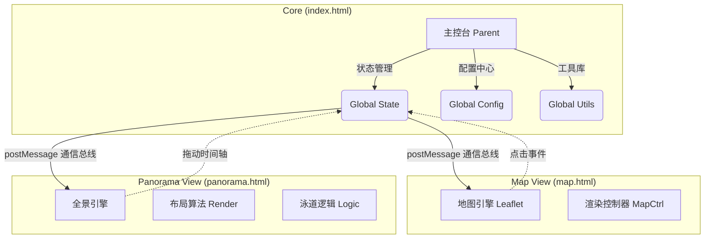

# 🌏 东亚历史交互地图 (East Asia History Interactive Map)

> **探索两千年的时空变迁，尽在指尖。**

[🌐 在线体验](https://wxinter17.github.io/Eastasia-history/) | [💻 GitHub 仓库](https://github.com/wxinter17/Eastasia-history)

---

## 📖 项目简介

**东亚历史交互地图**是一个致力于将枯燥的历史数据转化为直观视觉体验的 Web 项目。它不仅仅是一张地图，更是一台时光机。

无论你是历史爱好者、学生还是研究人员，通过本项目，你都可以：

* 🖱️ **自由穿越**：在公元前 2070 年至今的时间长河中任意跳转。
* 🗺️ **俯瞰疆域**：清晰地看到不同朝代、政权在东亚大陆上的疆域消长。
* 📜 **理清脉络**：通过创新的"全景时间轴"，一目了然地看清政权的演变逻辑。
* 🤖 **AI 辅助**：内置 Gemini AI，实时解答你的历史疑惑（需配置 API Key）。

---

## � 核心界面与功能

本项目采用 **双视图 (Twin-View)** 设计，左手地图，右手时间轴，实现时空同步。

### 1. 🗺️ 地图视图 (Map View)

*这是你的"空间"视角。*

* **实时疆域渲染**：基于 Leaflet 引擎，根据当前年份实时绘制政权版图。
* **智能色彩**：每个政权拥有基于哈希算法生成的独特配色，视觉清晰。
* **仿古模式**：一键切换复古滤镜，沉浸感拉满。
* **交互点击**：点击任意地块，即可查看该政权的详细信息、存续时间及宗主关系。

### 2. 🎞️ 全景视图 (Panorama View)

*这是你的"时间"视角。*

* **线性历史流**：不再是枯燥的列表，而是像河流一样流淌的历史。
* **泳道算法**：智能处理"并立政权"（如三国、南北朝），让它们在同一时间轴上互不遮挡，清晰并列。
* **物理合并**：对于跨越多个地理区域的大帝国（如唐、元），系统会自动合并显示为一个宏大的标签，尽显霸气。
* **智能防撞**：标签自动避让，保证文字不重叠，阅读体验极佳。

### 3. 🤖 AI 历史顾问

*内置 Gemini AI 支持。*

* **智能核查**：点击政权详情页的 `✨ AI 历史简述 / 核查` 按钮，AI 将为你分析该政权在当前区域的统治史实。
* **时间线验证**：AI 会帮你核对系统记录的时间是否准确，并提供历史背景补充。

---

## ⚙️ 系统架构设计

为了保证高性能和低耦合，本项目采用了基于 `iframe` 的微前端架构设计。



* **index.html**: 大脑。负责加载数据、管理全局状态（年份、选中政权）、处理 API Key，并协调两个子页面。
* **map.html**: 绘图师。只专注地图渲染，接收主页面的指令。
* **panorama.html**: 史官。专注时间轴的排版和绘制，计算复杂的政权更替逻辑。

---

## 🕹️ 使用指南

### 基础操作

1. **切换视图**：点击顶部导航栏左侧的 `空间` / `全景` 按钮。
2. **时间旅行**：
   * **地图页**：点击右侧面板的年份进度条，或使用顶部下拉菜单 `⏱️ 跳转`。
   * **全景页**：直接拖动中间的时间轴，或者点击具体的政权色块。
3. **搜索政权**：在顶部搜索框输入（如"唐朝"），系统会自动定位并高亮。

### 进阶功能 (工具箱 🛠️)

点击右上角的工具箱图标，你可以：

* **🔑 配置 API Key**：输入 Google Gemini API Key 以解锁 AI 功能。
* **📜 仿古模式**：开启/关闭复古地图滤镜。
* **🗺️ 省界开关**：叠加现代省界线，辅助定位。
* **💾 导出坐标**：获取当前地图的 GeoJSON 数据（开发者功能）。

---

## 📦 部署与运行

本项目 **零依赖**，无需安装 Node.js 或 Webpack，开箱即用。

**方式一：直接运行 (推荐)**

如果你有 Python 环境：

```bash
python3 -m http.server 8000
# 然后浏览器访问 http://localhost:8000
```

**方式二：静态托管**

直接将文件夹上传至 GitHub Pages 或任何静态 Web 服务器即可。

---

## 🤝 贡献

项目目前由单人维护，欢迎各类建议！

---

*Created with ❤️ for History.*
